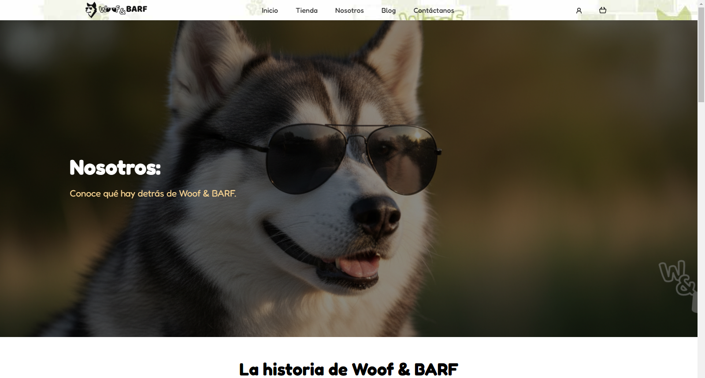

# Proyecto Integrador – “Woof & BARF”  
Creación de una plataforma web de e-commerce para venta de alimento basado en dieta BARF para perros  
Desarrollado como parte del Bootcamp Java Full Stack  

---

## 🧭 Tabla de contenidos  
- [Descripción del proyecto](#descripción-del-proyecto)  
- [Características principales](#características-principales)  
- [Tecnologías utilizadas](#tecnologías-utilizadas)  
- [Estructura del proyecto](#estructura-del-proyecto)  
- [Instalación y puesta en marcha](#instalación-y-puesta-en-marcha)  
- [Cómo usarlo](#cómo-usarlo)  
- [Capturas de pantalla](#📸-capturas-de-pantalla)  
- [Contribuciones](#contribuciones)  
- [Equipo de desarrollo](#equipo-de-desarrollo)  
- [Licencia](#licencia)  
- [Contacto](#contacto)  

---

## 🐾 Descripción del proyecto  
Este proyecto consiste en el desarrollo de una plataforma web de e-commerce llamada **Woof & BARF**, especializada en la venta de alimentos para perros basados en la dieta BARF (Biologically Appropriate Raw Food).  
El objetivo es ofrecer una experiencia de compra ágil, intuitiva y responsive, con un catálogo de productos, carrito de compras y administración de usuarios.  

Se desarrolló como proyecto integrador del **Bootcamp Java Full Stack**, utilizando HTML, CSS, JavaScript y Bootstrap como principales tecnologías de interfaz de usuario.  
En las carpetas `backend` y `database` se encuentran los componentes de servidor y base de datos (cuando aplique).  

---

## 🌟 Características principales  
- Diseño **responsive** adaptable a distintos dispositivos.  
- Interfaz moderna, clara y funcional.  
- Páginas principales:  
  - **Inicio** – Presentación del sitio y la marca.  
  - **Tienda** – Catálogo de productos que el usuario puede ver y añadir al carrito.  
  - **Nosotros** – Misión, valores y equipo.  
  - **Blog** – Artículos sobre alimentación BARF.  
  - **Contáctanos** – Formulario de contacto funcional.  
  - **Inicio de sesión / Registro** – Para usuarios registrados.  
  - **Carrito de compras** – Resumen y control de los productos seleccionados.  
- Gestión de usuarios y persistencia del carrito (en desarrollo).  
- Navegación intuitiva con retroalimentación visual.  

---

## 🧰 Tecnologías utilizadas  
- **HTML5** – estructura del contenido.  
- **CSS3** – estilos y diseño responsive.  
- **JavaScript (ES6+)** – interactividad, validaciones y carrito.  
- **Bootstrap 5** – framework de diseño UI.  
- **Node.js / Express** *(si aplica)* – backend.  
- **SQL / MySQL**  – base de datos.  
- Herramientas: **Git**, **GitHub**, **VS Code**, **Figma** (para diseño).  

---

## 📁 Estructura del proyecto  
Proyecto-Integrador/

├── .vscode/ ← Configuración del editor (opcional)
├── backend/ ← Código del servidor (API, lógica de negocio)
├── database/ ← Scripts o datos de la base de datos
├── docs/ ← Documentación adicional
├── public/ ← Archivos públicos (HTML, CSS, JS del frontend)
│ ├── index.html
│ ├── tienda.html
│ ├── carrito.html
│ ├── blog.html
│ ├── contacto.html
│ ├── nosotros.html
│ ├── js/
│ └── css/
├── assets/ ← Imágenes, íconos y multimedia
├── README.md ← Este archivo

## 🖱️ Cómo usarlo

1. Regístrate o inicia sesión.
2. Explora la Tienda y añade productos al carrito.
3. Accede al Carrito para revisar los artículos y el total.
4. Utiliza el Blog para leer artículos informativos.
5. En caso de dudas, usa el formulario de Contáctanos.
6. (Si eres administrador) accede al backend para gestionar usuarios y productos.

## 📸 Capturas de pantalla
🏠 Página de inicio
Presentación principal con menú de navegación y banner destacando la marca Woof & BARF.

## 🛍️ Tienda de productos
Catálogo dinámico donde los usuarios pueden añadir artículos al carrito.

## 🛒 Carrito de compras
Vista del carrito donde se resumen los productos seleccionados y el total a pagar.

## 👥 Página “Nosotros”
Presentación del equipo de trabajo, misión, visión y valores de la marca.

## 📞 Formulario de contacto
Sección para que los usuarios se comuniquen con el equipo mediante un formulario funcional.

## 👩‍💻 Equipo de desarrollo
Proyecto realizado por:
| Integrante       | Rol / Responsabilidad    |
| ---------------- | ------------------------ |
| Brad Robles      | Leader Data base         |
| Deyanira Ruiz    | Product Owner            |
| Joana Barbosa    | Data base                |
| Karen Nava       | Full-stack Developer     |
| Omar Albis       | Scrum Master             |
| Ricardo de Jesús | Backend Developer        |
| Ricardo Avilés   | Data base                |
| Veaney Vargas    | UX/UI Designer           |

## 📬 Contacto 
Si tienes dudas o sugerencias, puedes contactar al equipo mediante:

El formulario de “Contáctanos” dentro del sitio.

Correo: woofandbarf@gmail.com

Última versión estable: v1.0.0
Proyecto Integrador – Bootcamp Java Full Stack
https://github.com/Arukado69/Proyecto-Integrador
